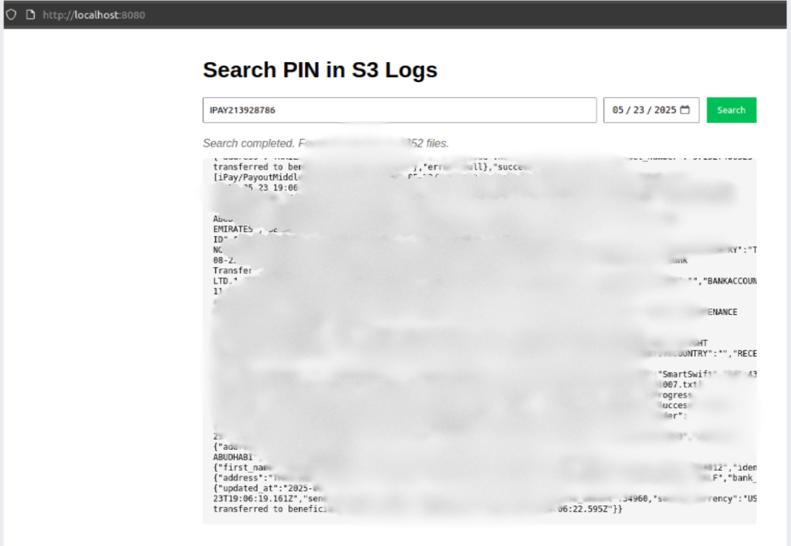

# S3 Log Search Tool

A web application for searching transaction logs stored in AWS S3 by PIN number.

 

## Features

- Search transaction logs across thousands of S3 files
- Real-time progress updates with files processed and matches found
- Date filtering capability
- Responsive web interface
- Server-Sent Events (SSE) for live updates
- Automatic reconnection if connection drops
- Manual search cancellation option

## Technology Stack

- **Frontend**: HTML5, CSS3, JavaScript (EventSource API)
- **Backend**: Python, Flask
- **AWS Services**: S3
- **Infrastructure**: Docker, Docker Compose

## Prerequisites

- Docker
- Docker Compose
- AWS credentials with S3 read access

## Installation

1. Clone the repository:
   ```bash
   git clone https://github.com/Ted0011/s3-query-using-docker.git
   cd s3-query-using-docker
   
2. Create a .env file in the project root with your AWS credentials:
   ```env
   AWS_ACCESS_KEY_ID=your_access_key
   AWS_SECRET_ACCESS_KEY=your_secret_key
   AWS_DEFAULT_REGION=your_region
   
## CONFIGURATION

Modify these variables in app.py:
bucket_name = 'fintech-logs-prod'  # Your S3 bucket name
base_prefix = 'iPay/PayoutMiddleware/SmartSwift'  # Base path for logs

## RUNNING THE APPLICATION

Start the services using Docker Compose:
   ```bash
   docker-compose up --build -d

The application will be available at:
    Frontend: http://localhost:8080
    Backend: http://localhost:5000
    
## Usage

    1. Open http://localhost:8080 in your browser
    2. Enter a PIN number (e.g., "IPAY338992910")
    3. Optionally select a date to narrow the search
    4. Click "Search"
    5. View real-time results as they're found
    6. Use "Stop Search" button to cancel if needed
    
## Architecture

   ```bash
   frontend (nginx) → backend (Flask) → AWS S3
   
## API Endpoints
    GET /search?pin=<PIN>&date=<YYYY-MM-DD>
    Returns Server-Sent Events stream with search results
